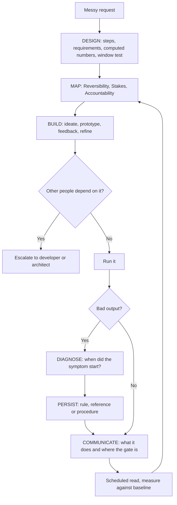
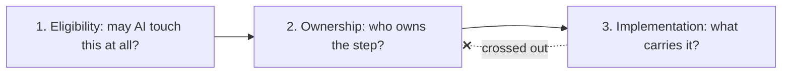
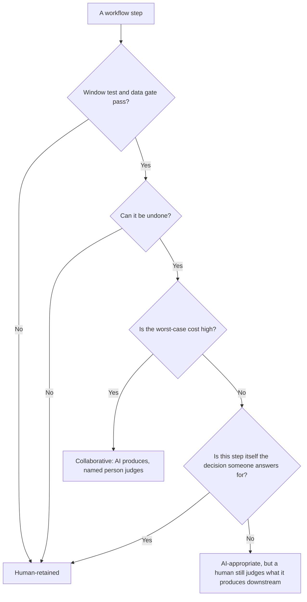
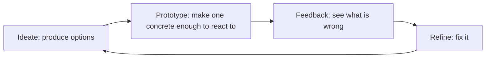
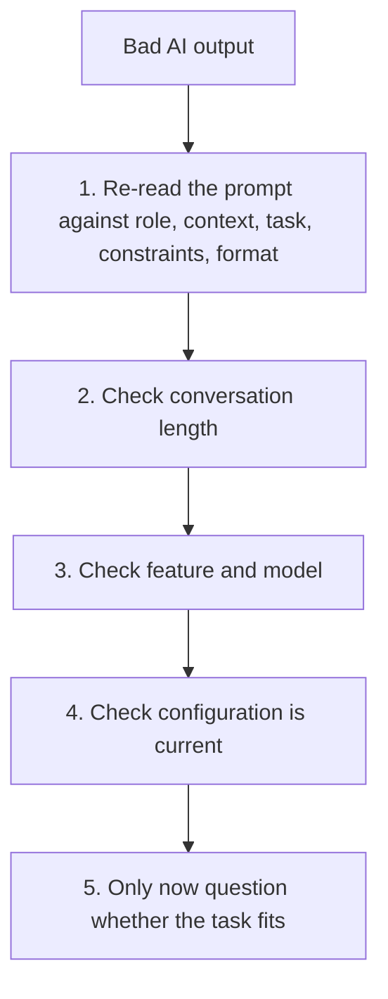
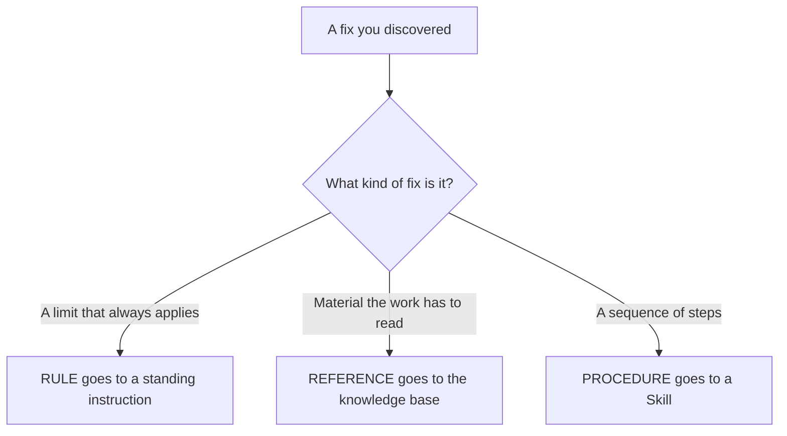
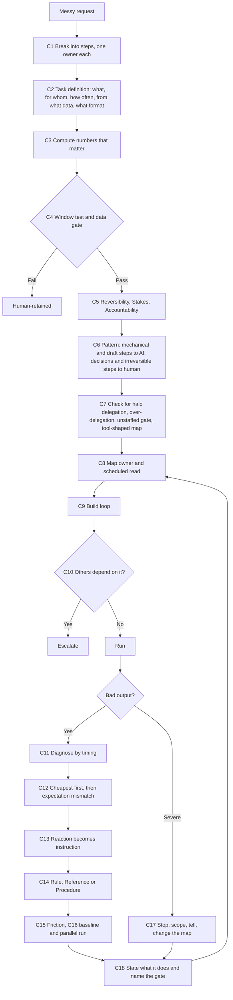

# Poora Course: Workflow Design & Diagnosis, Start se End Tak

Yeh ek hi flow hai. Har concept pichhle concept ke masle se paida hota hai, aur agla concept us ke adhoore hisse ko poora karta hai. Jahan koi gehri baat aati hai, wahan **🔎 Deep Concept** ka box hai. Part 1 (Concepts 1 se 4) maine pehle detail mein samjha diya tha, isliye yahan uska nichod hai aur asli tafseel Part 2 se shuru hoti hai.

## Poori kahani ek nazar mein

Isay yun parho: kaam pehle design hota hai, phir map hota hai ke kaun kya own kare, phir banta hai, phir chalta hai. Kharabi aaye to timing se pakri jati hai, fix configuration mein rakha jata hai, aur bolte waqt gate ka naam liya jata hai. Aakhir mein scheduled read map ko dobara review karta hai, isliye tir wapas Map par jata hai.

---

# Part 1 ka nichod: Pehle kaam ko samjho

Course ek waqia se shuru hota hai. Do teams ne ek hi tool, ek hi model aur ek hi kaam (contract review) par kaam kiya. Pehli team ne kaam ko steps mein dekha. AI ne clauses nikaale, policy se hatne wali cheezein flag ki aur redline (badlaao ka marked-up version) likha, lekin **har badlaao ko lawyer ne approve kiya**. Review ka waqt takreeban aadha ho gaya aur quality barqarar rahi. Doosri team ne AI ko poore process par laga diya aur low-risk clauses khud approve karne diye. Ek mahine mein ek approved clause ne aisi obligation bana di jo kisi ne pakri nahi, aur tool hata diya gaya. Farq sirf is mein tha ke **kaunse steps diye gaye**.

> 🔎 **Deep Concept: "The output is not the verdict."** Achha draft dekh kar "step safe hai" kehna aur bura jawab dekh kar "task impossible hai" kehna, dono ek hi ghalti hain: output ko faisla bana lena. Faisla in chaar cheezon se hota hai: kaunsa step hai, ghalti ka cost kya hai, jawabdeh kaun hai, aur symptom kab shuru hua.

Isi ghalti se bachne ke liye Part 1 chaar cheezein sikhata hai. **Concept 1:** kaam ko named steps mein todo, jinka ek owner ho, kyunke session ko aap baad mein judge karte hain jabke step ka faisla pehle hota hai. **Concept 2:** kaam ko requirements mein badlo, "better reporting" jaisi baat ko paanch jawabon (kya, kis ke liye, kitni baar, kis data se, kis format mein) mein tod kar, aur jo jawab nahi mila usay AI ko bharne mat do. **Concept 3:** jo number matter karta hai use code execution se compute karwao, kyunke likha hua aur calculate kiya hua number dekhne mein ek jaisa lagta hai. **Concept 4:** window test lagao, yaani poocho ke is step ko jo kuch chahiye woh sab model ke saamne rakh sakte hain ya nahi. Jo nahi rakh sakte (jaise hiring freeze), woh step insaan ka hai.

---

# Part 2: Delegation Map, yaani kaun kya own kare

Part 1 ke baad tumhare paas steps ki ek list hai jismein har step window test paas kar chuka hai. Lekin "AI kar sakta hai" ka matlab "AI ko karna chahiye" nahi hota. Yahan course ek zaroori tarteeb sikhata hai: har step par **teen alag faisle** hote hain, aur inhein mila dene se aisa map bantah hai jo theek lagta hai aur hota ghalat hai.

Pehla faisla **Eligibility** hai: kya AI is cheez ko chhoo bhi sakta hai? Iske do gate hain. Kya yeh data is tool mein jaa sakta hai? (Yeh Governance course ka sawal hai, jo agla course hai.) Aur kya step ko chahiye hui saari cheez supply ho sakti hai? (Yeh window test hai.) Kisi bhi gate par "nahi" ho to sawal wahin khatam ho jata hai, chahe step kitna hi mechanical lage. Doosra faisla **Ownership** hai: step kis ka hai, jo teen criteria se tay hota hai. Teesra faisla **Implementation** hai: step ko carry kaun karega, aur yeh sirf un steps ke liye hota hai jo pehle do faisle paas kar chuke.

Chart mein aakhri kata hua tir woh ghalti hai jo course rokta hai: teesre faisle ko dusre mein ghusa dena.

> 🔎 **Deep Concept: Carried by aur Criterion do alag columns hain.** "Yeh number compute karna zaroori hai" bilkul sach baat hai, lekin yeh implementation ka jawab hai (code execution). Yeh yeh nahi batati ke step AI ko dena chahiye ya nahi. Agar aap "compute hona chahiye" ko delegation ki wajah bana lein, to ek high-stakes calculation bina review ke chali jati hai.

Implementation ka jadval yeh hai. Repeatable fixed-step procedure **Skill** carry karta hai, kyunke woh har kisi ke liye same chalta hai. Jo rules aur reference step ko hamesha chahiye hon woh **Project knowledge** mein hote hain. Jis calculation par output tika ho woh **code execution** se hoti hai. Har output par lagne wali hadd **standing instruction** mein jati hai. Aur jo step insaan ka ho, us ke liye **named review gate** chahiye: ek banda, ek lamha, aur ek cheez jo woh check karta hai. Sirf "human" likh dena kaafi nahi, kyunke "koi dekh lega" wahi tareeqa hai jis se gate unstaffed ho jata hai.

## Concept 5: Teen criteria jo har step ka owner tay karte hain

Ab asal sawal: Ownership kis basis par tay hota hai? Har step ko teen mein se ek category mein rakhna hai. **AI-appropriate** yani AI own kar sakta hai, **human-retained** yani insaan poori tarah own karta hai, ya **collaborative** yani AI banata hai aur ek named insaan judge karta hai. Faisla sirf teen sawalon se hota hai, aur teeno step ke baare mein hain, model ke baare mein nahi.

**Reversibility:** kya ghalti hone par step undo ho sakta hai? Draft dobara likha ja sakta hai, lekin bheji hui email wapas nahi aati. Undo hone wale steps delegation bardasht kar lete hain, kyunke ghalti ki qeemat sirf redo hoti hai. **Stakes:** ghalti ka nuksan kitna hai, aur yahan "aam tor par" nahi balki **sab se buri halat mein**. Ghalat label ek minute ka nuksan hai, ghalat penalty figure jitni bhi penalty hai utna nuksan hai. **Accountability:** is step ka jawabdeh kaun hai? Har step ka koi na koi jawabdeh hota hai, isliye sirf yeh sawal har step ko insaan ke paas rakh deta. Asal sawal yeh hai: kya yeh step **khud woh faisla hai jis ka jawab koi deta hai**, ya ek **input jise koi baad mein judge karta hai**?

> 🔎 **Deep Concept: Accountability kabhi mashine par nahi jati.** Agar step ek input hai jise koi judge karta hai, to use delegate kar sakte hain, kyunke accountability judge karne wale ke paas rehti hai. Agar step khud faisla hai, to use delegate nahi kar sakte, kyunke uske baad koi bacha hi nahi jo usay uthaye. Har haal mein "AI ne kiya" jawab nahi hota, kyunke mashine se jawab talab nahi kiya ja sakta.

Do aur baatein jo exam mein phansati hain. Yeh teen sawal hain, score nahi: aap unhein jama nahi karte aur teen "haan" ka intezar nahi karte. Aam tor par ek criterion step ko tay karta hai aur baaki do us se sahmat hote hain, aur aap us ek ka **naam** lete hain taake koi doosra aap ki classification check kar sake. Jahan teeno ikhtilaf karein, wahan **sab se sakht wala jeetta hai**: agar step undo ho sakta hai aur sasta hai lekin phir bhi woh wohi faisla hai jis ka jawab koi deta hai, to woh insaan ka rahega. Aur ek cheez criterion **nahi** hai: is step par AI ne test run mein kitna achha kaam kiya. Iski wajah Concept 7 mein aati hai.

Yeh chart course ke jadval ka ek **[INTERPRETATION]** hai, yaani mera banaya hua visual helper. Course khud ek flowchart nahi deta, woh sirf teen sawal aur "strictest wins" ka rule deta hai. Chart is liye rakha hai ke tum dekh sako ke teeno sawal ek doosre ke saath kaise milte hain.

## Concept 6: Do alag kaam, same criteria, same pattern

Sawal yeh uthta hai ke kya yeh teen criteria sirf legal kaam ke liye theek hain? Course jawab dene ke liye do bilkul alag workflows par same criteria lagata hai. **Contract review** mein clause extraction AI ka hai (reversible, low stakes), playbook se hatne wali cheezein flag karna AI ka hai (reversible, aur ghalti redline par nazar aa jati hai), redline ka draft collaborative hai (high stakes, isliye insaan har edit judge karta hai), penalty ka financial exposure compute karna AI ka hai (code execution se, aur agla row approval ka hai), har badlaao approve ya reject karna insaan ka hai (yeh woh faisla hai jis ka jawab koi deta hai), aur sign karke bhejna insaan ka hai (irreversible aur bahar ke liye binding).

Yahan do rows par log phanste hain. **Penalty-exposure wala row:** sirf arithmetic hone se koi step low-stakes nahi hota. Yeh figure approval ka faisla banati hai, aur agar ghalat ho to approval ghalat ho jata hai. Yeh step is liye AI ko dena theek hai ke nateeja undo ho sakta hai aur agle hi row par insaan ke saamne aata hai. Woh gate hata do to step AI-appropriate nahi rehta, chahe arithmetic wahi ho. **Playbook wala row:** flags AI ke liye is liye theek hain ke agle row par koi unhein parhta hai. Wohi step aise workflow mein jahan uske baad koi nahi parhta (jaise expenses ko travel policy se check karna), collaborative ban jata hai. Step wahi hai, farq is mein hai ke us ke baad **koi khada hai ya nahi**.

**Onboarding documents** mein bhi pattern wahi hai. HR export se details nikalna AI ka hai, offer letter ka draft AI ka hai, welcome note collaborative hai (manager ki awaaz supply nahi ho sakti), compensation ka confirm karna insaan ka hai (yahi check hai, is ke baad kuch nahi), aur signed offer bhejna insaan ka hai (irreversible). Mechanical aur draft steps AI ko gaye, aur confirm karne wala step aur wohi step jo undo nahi hota insaan ke paas rahe. Yeh kisi ke zauq ne tay nahi kiya, criteria ne kiya, aur do alag fields mein.

## Concept 7: Map kaise ghalat hota hai, aur ghalti ki wajah hamesha sach hoti hai

Doosri team lapaerwah nahi thi. Unhon ne hafton dekha ke AI redlines achhe likhta hai, phir kaha ke chalo aasan clauses bhi approve kar de. Yeh saboot par mabni ek maqool reaction hai, aur yehi woh tareeqa hai jis se workflow mein woh risk aata hai jo kisi ne chuna nahi. Isay course **over-delegation** kehta hai: AI ko step ke risk se zyada dena, aur yeh inaam ke raaste se hota hai, kyunke draft achha aata raha to agla step bhi safe lagta hai.

> 🔎 **Deep Concept: "Drafting quality is evidence about the draft. It is not evidence about the decision."** Achhi drafting ek step ka saboot hai, agle step ka nahi. Isi liye "AI ne test run mein achha kiya" teen criteria mein shamil nahi hai.

Course teen ghaltiyan batata hai jo sab maqool lagti hain. **Halo delegation:** pichhla step achha gaya, isliye agla bhi AI ko de diya. Salahiyat asli thi, lekin kisi doosre step ki thi. **Unstaffed gate:** ek collaborative step jis ka review ab asal mein hota hi nahi. Reviewer masroof hai, queue lambi hai, drafts do mahine se achhe aa rahe hain, to review nazar phir click ban jata hai. Kisi ne map nahi badla, lekin step ab automated hai, aur map bata nahi sakta kyunke map wo dikhata hai jo aap ne **design** kiya tha, jo chal raha hai woh nahi. **Tool ke hisaab se map banana:** team achhe Skill ke hisaab se workflow mein ek step bana leti hai. Yeh sab se mushkil hai dekhna, kyunke workflow tool ko achhi tarah use karta hai, lekin woh kaam nahi hai.

Course ka complaint workflow in teeno ko ek saath dikhata hai. Row 3 (severity classify karna) halo delegation hai, kyunke wajah yeh di gayi ke *summaries* accurate thin, jabke severity ek alag step hai jo tay karta hai ke customer escalate hoga ya nazar-andaz. Row 5 (response bhejna) over-delegation hai. "Sirf low severity" ek control lagta hai, lekin severity wahi system tay kar raha hai jo ab bina review ke bhej raha hai, aur ek step khud ko gate skip karne ki ijazat nahi de sakta. Bhejna undo bhi nahi hota. Row 2 (summarise karna) tool ke hisaab se map hai, kyunke wajah "hamara Skill bohat achha hai" di gayi. Row 4 mein khaas dhyan dene wali baat yeh hai ke duty agent har draft review karta hai, lekin kisi ne nahi kaha ke ek shift mein kitne drafts hote hain. Yeh sensible gate hai jis ke peechhe capacity check nahi. Har bayan sach tha, aur ghalat maps sach baaton se bante hain jo ghalat step par lagai jati hain.

Jaanchne ki tarteeb yeh hai: pehle kaam ko bina kisi tool ke map karo, phir har step ko akela classify karo, aur phir har collaborative step ke liye poochho ke review kaun kar raha hai aur kab. Yeh sawal baar baar poochho: **"Jo gates maine banaye the, kya woh ab bhi staffed hain?"**

## Concept 8: Map ka owner aur scheduled read

Map likhte waqt sahi hota hai, lekin phir kharab hota hai, kisi ke badalne se nahi balki is liye ke workflow uske neeche se hil jata hai. Ek step add ho gaya, reviewer ka role badal gaya, volume doguna ho gaya aur jo gate bees cases hafte par chalta tha woh pachaas par nahi chalta. Document ab bhi wo workflow dikhata hai jo aap ne design kiya tha.

> 🔎 **Deep Concept: Teen controls, aur teeno khamoshi se kharab hote hain.** Review gate (review nazar phir click banta hai), standing instruction (output dheere dheere rule se hatne lagta hai), aur map khud (aisay workflow ko describe karta hai jo koi chalata hi nahi). In teeno ke fail hone ke waqt **koi signal nahi aata**, isliye course ka jawab **scheduled read** hai: ek tay tareekh par map ka review.

Iske liye do cheezein chahiye. **Map owner** ek named banda hota hai, team nahi. Woh kaam khud nahi karta lekin is baat ka jawabdeh hota hai ke map hakikat se milta hai ya nahi. Aur ek **review date**, jo aam tor par har quarter hoti hai, aur agar volume, staffing ya legal position badle to jaldi. Review mein chaar sawal hote hain aur takreeban bees minute lagte hain. Kya koi step map ke baghair add ya remove hua? Har collaborative step ke liye pichhle hafte kis ne review kiya aur kitni dair? Kya volume ya stakes badle? Aur kya map jin configurations par depend karta hai (Skills, knowledge sources, standing instructions) woh abhi current hain?

> 🔎 **Deep Concept: Sawal 2 asli masle pakarta hai kyunke woh "pichhle hafte" ke baare mein hai, policy ke baare mein nahi.** Policy woh hai jo map pehle se kehta hai. Pichhla hafta woh hai jo hua. Agar koi jawab nahi de sakta ke kis ne review kiya, to step khamoshi se automated ho chuka hai aur map ghalat hai.

Map ka nateeja yeh hai ke owner aur review date ke baghair map takreeban ek quarter tak sahi rehta hai, aur unke saath yeh ek operating document hai jo unstaffed gate ko nateeje se pehle pakarta hai.

---

# Part 3: Banao, aur dekhte raho

Map tayyar hai aur steps ke owners tay hain. Ab kaam banana hai, aur yahan course ek ghalat khayal tordta hai: AI se solution **maangne** se nahi milta. AI ek design partner hai, vending machine nahi. Woh us cheez par react karta hai jo aap saamne rakhein, aur aap ki situation ke baare mein wohi jaanta hai jo aap ne bataya.

## Concept 9: Build loop

Loop ke chaar qadam hain aur usay kisi Project ke andar chalana chahiye taake background aur pichhle faisle stable rahein. Bikhri hui chats mein har round ek thodi si alag samajh se shuru hota hai, aur nateeja ek hal ki jagah drafts ka dher hota hai.

Course ek misaal deta hai jis mein ek analytics team ne bina code likhe ek chhota web page tool (artifact) banwaya. **Cycle 1** mein paanch charts wala dashboard aaya jo kaam karta tha, aur yehi cycle log ko zyada bharosa dilata hai kyunke abhi kuch mushkil poochha hi nahi gaya. **Cycle 2** mein date filter aur totals row maangi gayi. Filter theek chala lekin totals ghalat the, aur ghalat bhi aise ke size aur format sahi tha. Ek analyst ne sirf is liye pakra ke woh ek number ka andaza jaanti thi. **Cycle 3** mein brand colors aur print layout maange gaye, jo pehli baar mein theek chal gaye.

> 🔎 **Deep Concept: Cycle 2 aur Cycle 3 alag qism ke masle hain.** Cycle 3 ek **description** ka masla tha, aur behtar describe karne se hal ho gaya. Cycle 2 ek **feature** ka masla tha (totals likhe gaye the, compute nahi hue), aur chahe kitna hi behtar describe karo, hal nahi hota. Fix behtar prompt nahi, code execution thi. In dono ko alag karna hi asal hunar hai, aur Part 4 usi ka tareeqa hai.

Ek cheez aur yaad rakho. Cycle 2 khamoshi se fail hua, aur yehi maqsad hai. Shor wali failure kuch nahi sikhati kyunke error message bata deta hai kahan dekhna hai. Asal khatra woh failure hai jo review paas kar leti hai kyunke output saaf, formatted aur confident tha.

**[COURSE note]** Course ke "Sources" hisse ke mutabiq cycle 2 wala failing example is kitab ka apna izafa hai, asal material ne build loop ko sirf pehle cycle tak dikhaya tha.

## Concept 10: Jab kaam prompt-and-iterate se bada ho jaye

Dashboard ek chhoti team ki andarooni zaroorat ke liye chala. Chhe mahine baad teen departments har Monday isay kholte hain, aur ek department apne numbers board ki report mein daal deta hai. Ab woh ek alag cheez hai, aur kisi ne tay nahi kiya ke woh alag ho.

Course is moqe ko **escalation signal** kehta hai: jab doosre log kisi cheez par infrastructure ki tarah depend karne lagein. Us waqt usay woh cheezein chahiye jo pehle kabhi nahi thin: uptime, access control, koi jisay bulaya ja sake jab tootay, aur yeh guarantee ke woh aaj bhi wohi karta hai jo March mein karta tha. Yeh kaam developer ya architect ka hai. Escalate karna sahi jawab hai, shikast nahi. Shikast yeh hai ke aap woh cheez prompt se chalate rahein jab doosre us par depend kar chuke hon kyunke kisi ne us lamhe ko mark hi nahi kiya jab woh chhoti nahi rahi.

Ek aur signal hai jo milta julta lagta hai lekin kahin aur le jata hai. "Doosre log ab is par depend karte hain" ka matlab hai ke yeh infrastructure hai aur engineering chahiye. "Maine yeh ek hi tareeqe se teen baar hal kiya" ka matlab hai ke tareeqa stable hai aur usay manufacture kiya ja sakta hai, jiske liye course "From One-Off to Worker" ki taraf bhejta hai. Pehla sawal ye hai ke **kaun exposed hai**, doosra yeh ke **tareeqa badalna band hua ya nahi**.

---

# Part 4: Jab kaam kharab ho

Tum ne map bana liya, build kar liya, aur kabhi na kabhi output disappoint karega. Yahan course ek aam ghalti pakarta hai: log ya to haar maan lete hain ("tool yeh nahi kar sakta") ya random cheezein badalte hain. Dono sirf ek sawal ko chhod dete hain jo daayra sahi tang kar deta hai: **symptom pehli baar kab aaya?**

## Concept 11: Chaar wajahen, jo timing se alag hoti hain

Chaar wajahon se bura output page par lagbhag ek jaisa dikhta hai, lekin timing unhein alag karti hai, aur timing muft maloomat hai jo aap ke paas pehle se hoti hai.

> 🔎 **Deep Concept: "Timing tells you where to look first. It does not tell you what the cause is."** Timing pehla shak deti hai aur usay test karne ka sasta tareeqa, faisla nahi. Ek hi timing ki ek se zyada wajahen ho sakti hain: pehla jawab kharab hone ki wajah thin prompt bhi ho sakti hai, kharab source material bhi, ya yeh ke wohi prompt do baar do jawab deta hai. "Pehle chalta tha" ka matlab aksar setup ka drift hota hai, lekin kabhi task ki shakal badal jana bhi hota hai.

| Symptom kab aaya | Pehla shak | Ek minute ka test | Fix |
|---|---|---|---|
| Pehle jawab se hi ghalat | **Under-specification** | Prompt dobara parho: kya zaroori cheez us mein hai? | Jo chhoot gaya woh add karo |
| Shuru achha, phir girta gaya | **Context overload** | Naye session mein hidayat dohraao, kya woh tikti hai? | Restart ya summary |
| Ek hi qism ki ghalti bar bar | **Wrong feature ya model** | Sahi feature ya taqatwar tier se ek baar chalao | Feature ya tier badlo |
| Pehle chalta tha, ab nahi | **Stale configuration** | Instruction ya knowledge source kholo aur uski tareekh dekho | Configuration ki maintenance |

**Under-specification** ka matlab hai ke prompt mein woh cheez thi hi nahi jo step ko chahiye thi. Yeh sab se aam wajah hai aur sab se sasta fix. **Context overload** ka matlab hai ke conversation context window se lambi ho gayi, isliye purana text chhota ya hata diya jata hai aur shuru ki hidayaat ki taqat kam ho jati hai. Behtar prompt yahan kaam nahi karta kyunke masla naya likha hua prompt nahi hai. **Wrong feature ya model** ka matlab hai ke step ghalat tool ko gaya, aur yeh ek hi repeatable ghalti ki shakal mein aata hai: thode ghalat numbers ka matlab hai ke calculation prose mein maangi gayi, aur gehre kaam par sathhi jawab ka matlab hai ke tier speed ke liye chuna gaya (tier model ka version hota hai, tez aur sasta se le kar sust aur zyada qabil tak). Zyada prompting woh nahi khareed sakti jo tool paida nahi kar sakta. **Stale configuration** ka matlab hai ke setup ki koi cheez purani ho gayi.

> 🔎 **Deep Concept: Stale configuration khamoshi se fail hoti hai.** Baaki teen apna ehsaas dilati hain. Yeh nahi. Na error aata hai, na warning, aur koi lamha nahi aata jab kuch visibly rukta hai. Pichhle quarter ke figures Project knowledge mein pade hain aur is quarter ki report unhein quote karti hai, perfect formatting ke saath. Model ko pata nahi ke jo aap ne diya woh purana hai. Yeh unstaffed gate ki jorwaan hai: dono ek theek set kiya hua control hain jo sab ke bharose par sarakta hai, aur dono ko scheduled review pakarta hai.

## Concept 12: Sasta pehle, mehnga baad mein

Timing ka pehla shak mil gaya, lekin agar timing saaf na ho to kis order mein check karein? Course ki tarteeb yeh hai, aur yeh **sasta pehle** ke usool par hai.

Pehla qadam sirf prompt dobara parhna nahi hai. Prompt ko uske paanch hisson se milao: role, context (woh background jo model ko maloom hi nahi tha), task (saaf hidayat), constraints, aur format. Prompt likhne wale ko theek lagta hai kyunke jo cheez chhoot gayi woh us ke dimaagh mein baithi hoti hai. Hissa hissa dekhne se cheez ki kami nazar aati hai.

> 🔎 **Deep Concept: Log yeh ladder ulti chalte hain.** Disappointing output par pehla instinct sab se taqatwar model par jana ya task ko impossible kehna hai. Dono ladder ke neeche ki chaal hain jo upar ki cheezein check kiye baghair chali jati hain. Prompt dobara parhne mein seconds lagte hain aur sab se aam wajah wahin hoti hai.

Step 5 mojood hai aur kabhi sahi bhi hota hai. **Expectation mismatch** woh task hai jo aisi cheez maangta hai jo tool kar hi nahi sakta, jaise agle quarter ki bilkul sahi sales figure predict karna. Koi prompt, restart, feature change ya configuration check isay theek nahi kar sakta. Fix task mein hai: ek range maango jis ke saath assumptions hon, ya un drivers ka model jinhein aap adjust karke dobara chala sakein. Lekin yeh step 5 is liye hai ke pehle chaar sasti wajahen rule out ki gayi hon, aur farq isi mein hai. Pura sequence ek do minute leta hai aur zyada tar kisi sasti fix par ruk jata hai. Isay us waqt chalao jab output disappoint kare, **is se pehle ke tum soch lo ke kis ki ghalti hai**.

---

# Part 5: Fix ko permanent banao

Wajah mil gayi aur fix mil gaya. Ab masla yeh hai ke fix ko kho dene se kaise bachein.

## Concept 13: Reaction ko instruction mein badlo

Har disappointing output setup ke baare mein kuch batata hai, lekin zyada tar woh is liye zaya ho jata hai ke fix haath se kar liya jata hai. **Reaction** batati hai ke output kaisa laga: "generic hai", "theek nahi laga", "point miss ho gaya". **Instruction** batati hai ke kya badalna hai, taake agla output alag ho. Ek sawal reaction ko instruction mein badalta hai: *"Sahi hone ke liye kya maujood hona chahiye tha, aur setup ka kaunsa hissa isay control karta hai?"* Course ke jadval mein "too generic" ka instruction hai "audience aur woh ek action batao jo mujhe unse chahiye" aur lever prompt hai, "wrong tone" ke liye har draft par lagne wali tone constraint aur lever standing instruction hai, aur "purana data use kar raha hai" ke liye knowledge base mein source document badalna aur lever knowledge hai. Agar aap lever ka naam nahi le sakte, to woh critique abhi bhi reaction hai, aur agli koshish revision ki shakal mein ek andaza hogi.

## Concept 14: Rule, Reference, ya Procedure: fix ka sahi ghar

Fix milna aasan aadha hissa hai, mehnga aadha hissa usay kho dena hai. Monday ke session mein mila fix agar usi conversation mein reh gaya to agle Monday phir milega, aur us ke chhutti par jaane par doosra banda phir wahi cheez dhundega, har baar pehli baar jitni qeemat ke saath. Test chhota hai: *"Kya yeh correction dobara chahiye hogi, meri taraf se ya kisi aur ki?"* Agar haan, to woh configuration mein jati hai. Chat se configuration mein le jane ko course **promotion** kehta hai.

Har ghar alag cheez badalta hai. **Rule** Project ke andar **behavior** badalta hai ("hamesha pehli line mein target segment likho"). **Reference** **jo maloom hai** woh badalta hai (brand voice guide, mojooda product list). **Procedure** **kaam kaise hota hai** woh badalta hai ("weekly report isi format mein, isi tarteeb se banao"). Ghalat ghar ki wajah se kuch improvements tikte nahi: procedure ko ek line ki instruction bana kar paste karo to uske steps kho jate hain, aur reference material ko standing instruction mein thoos do to har prompt bhari ho jata hai, chahe us run ko uski zaroorat ho ya nahi.

> 🔎 **Deep Concept: Rule / Reference / Procedure ek "kya badalta hai" ka test hai.** Rule behavior badalta hai, reference maloomat badalta hai, procedure tareeqa badalta hai. Exam mein sab se aam ghalti yeh hoti hai ke procedure ko rule bana diya jata hai. Agar jawab mein **tarteeb** ho (pehle yeh, phir woh), to woh procedure hai, aur ek line ki instruction tarteeb kho deti hai.

Course do logon ki misaal deta hai jo ek aadat ke farq par hain. Ek marketer ne dekha ke har campaign brief mein target segment chhoot jata hai aur call to action dab jata hai. Us ne haath se theek karna chhod kar do standing instructions briefs Project mein likh dein, aur ab har draft sabhi ke liye theek aata hai. Ek analyst ne pehle mahine samjha ke revenue report se canceled orders hatane hain, aur wo yeh yaad-dehani har mahine chat mein type karta raha. Woh har mahine kaam karta tha. Phir woh do hafte ki chhutti par gaya, colleague ne report chalayi, aur numbers canceled orders ke saath chale gaye. Fix hamesha mojood tha. Ghalti yeh thi ke woh aisi jagah tha jahan sirf ek banda usay dhoondh sakta tha.

> 🔎 **Deep Concept: Memory configuration ka badal nahi hai.** Assistants aap ke dohraye hue patterns pakar sakte hain, lekin woh **sirf aap ke liye** hota hai (chhutti par gaye bande ki jagah aane wale ko kuch nahi milta), aur **best-effort** hota hai (ho sakta hai pakre, ho sakta hai nahi; aap use point nahi kar sakte, parh nahi sakte, kisi ko de nahi sakte). Configuration woh shared ghar hai jo aap khol kar parh sakte hain. Dono istemal karo, bharosa configuration par karo.

## Concept 15: Optimize karne se pehle friction dhoondo

Kuch masle itne chhote hote hain ke unka ehsaas hi mar jata hai. **Friction** ek chhoti dohrayi jane wali qeemat hai jise aap ne notice karna chhod diya hai. Do minute ka reformat koi nahi ginta, lekin saal mein pachaas baar hota hai. Teen signals hain jinhein configuration door kar sakti hai. **Repetition:** aap har run mein wohi cheez paste ya type karte hain, aur ilaaj saved context ya standing instruction hai. **Correction:** aap har output mein wohi flaw theek karte hain, aur ilaaj yeh hai ke configuration badle taake woh aana band ho. **Variance:** ek hi task karne wale alag log alag nateeja lete hain, aur ilaaj shared Skill ya knowledge base hai.

> 🔎 **Deep Concept: Variance woh friction hai jo koi ek banda mehsoos nahi karta.** Inconsistency sirf logon ke **darmiyan** mojood hoti hai, isliye woh reviewer par nazar aati hai jo teen alag shakal ke outputs ko ek karne mein laga hai. Har individual ko apna output theek lagta hai.

Friction door karne ke do tareeqe hain aur tarteeb zaroori hai. **Consolidate** ka matlab hai steps ko ek saath chalana, taake teen prompts jin mein har ek ko wohi background chahiye ek prompt ban jayein. **Promote** ka matlab hai dohraya hua pattern configuration mein le jana, jaisa Concept 14 mein hua. Consolidation steps ki tadaad kam karta hai, promotion baqi steps ki qeemat kam karta hai, aur consolidate pehle karo, kyunke jis step ko aap merge karne wale the usay promote karna aisi mehnat hai jo karni hi nahi thi.

Course ka ek worked audit dekho. Ek team ki weekly reporting har analyst ka takreeban 45 minute leti hai aur output is par depend karta hai ke kis ne chalayi. Audit ne teen frictions dhoondi: har analyst wohi background dobara paste karta hai, output haath se reformat karta hai, aur alag alag masle pakadta hai. Concept 14 ke test se tarteeb: background reference hai isliye shared Project knowledge base mein, report ka format procedure hai isliye Skill, aur checking rule hai isliye standing instruction. Nateeja takreeban 25 minute per analyst, poori team mein ek jaisa format, aur ek revision round kam.

## Concept 16: Us cheez ko naapo jis ki tumhein parwah hai

Improvement jo naap na sako usay justify karna mushkil hai aur barqarar rakhna aur bhi mushkil. Upar wala "45 se 25 minute" ka jumla sirf is liye kaha ja sakta hai ke kisi ne badalne se **pehle** waqt naapa. Yeh **baseline** hai. Ek cycle mein workflow ko badle baghair ek baar chalao aur teen cheezein likho: kitna waqt laga, kitne revision rounds lage, aur kitne manual steps haath se kiye. Baad mein baseline dobara nahi ban sakti, kyunke purane tareeqe ka apna andaza aap ki taraf jhuka hota hai.

> 🔎 **Deep Concept: Sirf waqt ki bachat aksar sahi metric nahi hoti.** Metric us cheez ke hisaab se chuno jis ki wajah se workflow matter karta hai. Andarooni draft ke liye **time** (raftaar maqsad hai aur chhoti ghaltiyan sasti hain). Customer-facing report ke liye **consistency** (alag alag formats bharosa dilay se zyada tezi se khatam karte hain). Compliance ya finance output ke liye **accuracy** (ek ghalat figure ek ghante ki bachat se zyada mehnga hai). Kai logon ke kiye kaam ke liye **variance** (qeemat logon ke darmiyan hoti hai, kisi ek ke andar nahi). Metric ka naam pehle lena yeh bhi batata hai ke kab ruk jana hai: jab wohi metric kaafi achha ho jaye, aur tuning khud ek friction ban jati hai.

Phir **parallel run** hai: purana aur naya workflow do ya teen rounds saath chalana. Isme asal duplicate mehnat lagti hai, lekin yeh teen cheezein khareedta hai: saboot ke naya tareeqa aap ke metric par behtar hai, agar nahi to ek chalta hua fallback, aur un logon ki razamandi jin ka kaam badla. Aakhri cheez sab se zaroori hai, kyunke parallel run "hum aap ki job badal rahe hain" ko "hum ne dono chalaye, yeh dekho kya hua" mein badal deta hai. Nateeja saaf ho to poori tarah switch karo aur purana process ek cycle aur likha hua rakho.

Aur yeh bhi tayyar rakho ke iski **qeemat** kya hai. Cost woh hai jo AI tool ke liye dete ho aur woh insani waqt jo abhi bhi is mein hai (jo gates tum ne rakhe). Saving baseline ko is baat se guna karke nikalti hai ke woh kitni baar chalta hai aur kitne log chalate hain: hafte mein bees minute teen analysts par saal mein takreeban pachaas ghante bante hain, aur yeh aisa jumla hai jis par manager amal kar sakta hai. Phir woh risk bhi batao jo tumhare gates ke baad bhi bacha hai, kyunke jo business case ek risk chhupa le, us par se bharosa uth jata hai.

---

# Part 6: Chalao, aur samjhao

Sab kuch rokne ke liye hai ke bura output kisi tak na pahunche, lekin kuch bhi use zero nahi karta. Kisi busy Friday ko ek gate chhoot jayega, ya ek configuration review ke darmiyan purani ho jayegi, aur ek din tumhara design kiya hua workflow woh bhej dega jo nahi bhejna chahiye tha. Us waqt design ka faisla agle ghante mein hota hai, map par nahi.

## Concept 17: Jab bura output bahar nikal jaye

Zyada tar teams ke paas us ghante ka koi plan nahi hota, isliye jawab improvise hota hai, sust hota hai aur defensive hota hai. Pehle ghante ka procedure (rokna, hakaayaat likhna, apne organization ke raaste se report karna) **Governance** course mein hai. Yahan woh chaar faisle hain jo workflow ka designer **pehle se** karta hai taake us procedure ke paas kuch ho jis par kaam kare.

Pehla, **kaise roka jaye**: is workflow ko rokne ka sab se tez tareeqa kya hai, kaun rok sakta hai, aur kya use ijazat chahiye? Agar imaandar jawab hai "hamein us se poochna parega jis ne isay set kiya tha," to pehle yeh theek karo, kyunke baqi har qadam intezar karta hai. Doosra, **kya bahar ja chuka hai**: sawal yeh nahi ke ek output ghalat tha, balki **kitne outputs par asar hua aur woh kahan gaye**. Stale configuration ek ghalat nateeja paida nahi karti, woh un tamam nateejon ko kharab karti hai jo purani hone ke baad se bane, aur kisi ko yeh nahi pata ke woh kaunsa din tha. Teesra, **kis ko aur kab batana hai**: customer, andarooni owner, aur agar aap ke organization mein risk ya compliance team hai to woh. Yeh pehle tay karo, kyunke us lamhe mein der karne ki khinchaao bohat zyada hoti hai, aur der se batana jaldi batane se bohat mehnga parta hai. Chautha, **map mein kya badlega**: har incident design ke baare mein kuch batata hai. Chaar wajahon mein se kaunsi thi? Kya koi step ghalat classify hua tha, ya sahi classify hua tha lekin gate staffed nahi tha? Map mein badlaao karo, tareekh ke saath, taake fix us hafte se zyada tike jab sab dhyan de rahe the.

> 🔎 **Deep Concept: Faisle 1 aur 4 designer ke hain, aur design ke waqt hote hain ya hote hi nahi.** Rokne ka raasta aur map ka update dono woh cheezein hain jo incident ke beech mein banai nahi ja sakti. Jo team keh sakti hai ke workflow ghalat hone par woh kya karti hai, usi ko workflow chalane ki ijazat milti hai.

## Concept 18: Batao ke woh kya karta hai, phir gate ka naam lo

Ab aakhri masla: AI ko team ke workflow mein daal kar us logon ko describe karna hai jinhon ne isay banaya nahi: manager, client, risk team, bahar ka reviewer. Aap par bharosa tab hota hai jab aap sahi hote hain, yani jab limits utni saaf bataye jitni value. Tool ki salahiyat ko badha chadha kar batana pehli nazar aane wali ghalti par bharosa khone ka aam raasta hai.

Teen jumle hain jo overstate karte hain aur teeno aam hain. **"Fully automated"** lagbhag kabhi sach nahi hota aur pehli visible ghalti ise sab ke saamne ujagar kar deti hai. **"AI handles X"** insani gate ko jumle se nikal deta hai, aur sunne wala samjhta hai ke koi gate hai hi nahi. **"Yeh basically insaan jitna achha hai Y mein"** ek aisa mayaar bana deta hai jo tool kabhi na kabhi chhoot dega, us ke saamne jisay yaad hoga ke aap ne kaha tha.

> 🔎 **Deep Concept: Mareez ka ilaaj ek hi hai, aur sirf ek jumla zyada lagta hai.** **Batao ke tool kya karta hai, phir insani checkpoint ka naam lo.** Jab audience yeh tay kar rahi ho ke workflow par bharosa kare ya nahi, to teesri cheez bhi shamil karo: **kya kya woh refuse karta hai**, yaani woh cases jinhein woh bana hi is liye hai ke inkaar karke insaan ko de: unclear clause, ghair-mamooli contract, playbook se bahar ki request. Us list ka naam lena saabit karta hai ke hadd pehle se design hui thi, kisi incident ne nahi dhoondi.

Course ek hi workflow ko teen audiences ke liye teen tarah bayan karta hai. **Legal lead** ko mechanism aur failure modes chahiye: "Woh clauses nikalta hai, playbook se hatne wali cheezein mark karta hai aur pehla redline likhta hai. Badlaao approve karna abhi bhi aap ka hai. Dhyan rakhne wali cheez woh obligation hai jo sirf ishaare se hai aur likhi nahi gayi, jo woh chhoot sakta hai." **Practice executive** ko nateeja aur oversight chahiye: "Standard contract ka turnaround do din se takreeban aadhe din par aa gaya hai, wahi approval ka mayaar, aur ek lawyer har badlaao bahar jaane se pehle sign off karta hai." **Client ki risk function** ko control chahiye: "Drafting AI ki madad se hoti hai. Ek qualified lawyer har term review aur approve karta hai, aur us sign-off ke baghair kuch nahi bheja jata." Alag alag tafseel, lekin teenon mein se koi bhi gate ko nahi hatata.

> 🔎 **Deep Concept: Stakeholders insani checkpoints saaf hone par zyada bharosa karte hain, kam nahi.** Instinct yeh hota hai ke insani shamooliyat kam dikhayi jaye kyunke isse lagta hai ke tool kam kar raha hai. Asar ulta hota hai. "AI karta hai" aur "AI ghalat ho to kya hota hai" ke darmiyan ka be-wazahat khala wohi hai jahan risk team sunna band kar deti hai. Aur legal lead wale jumle mein "yeh cheez woh chhoot sakta hai" wahi hai jo aap Part 1 mein nahi likh sakte the, kyunke aap ko apni failure modes maloom hi nahi thin. Sahi bayan diagnose karne ke **baad** likha jata hai, pehle nahi.

---

# Poori kahani ek diagram mein

# Ek jumle mein poora course

> **Output verdict nahi hai. Step ko is se judge karo ke woh kitna mehnga parta hai aur us ka jawab kaun deta hai, aur kharabi ko is se ke woh kab shuru hui.**

Source discipline ke liye ek baat: course ke "Sources" hisse ke mutabiq framework Anthropic ke Claude Certified Associate material se aata hai, lekin window test, Concept 9 ka failing cycle, unstaffed gate aur stale configuration ki jorwaan, aur Concept 8 aur 17 ka map ownership aur incident decisions is kitab ke apne izafe hain. Upar maine jahan chart banaya (jaise Concept 5 ka decision tree) woh mera visual helper hai, course ka apna nahi.
